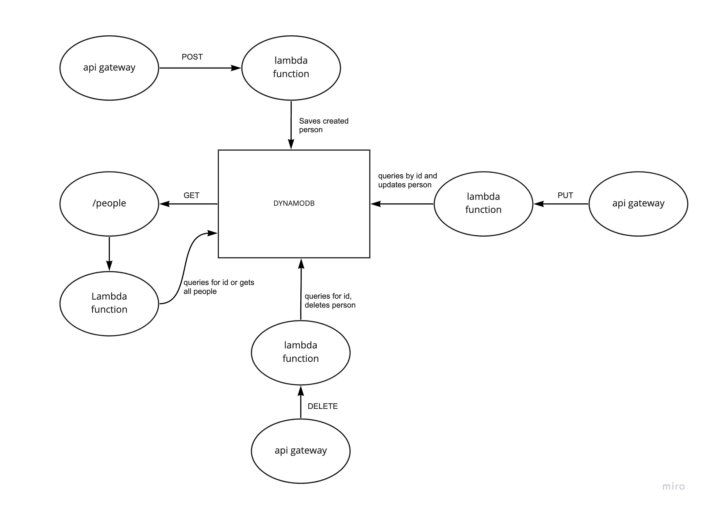

# Serverless API

***

## Created by Cameron Walden

***

## Root URL for API

https://r3ta8qrsie.execute-api.us-west-2.amazonaws.com/Production/people

***

## Routes

- **POST**
   - /people
   
- **GET**
  - /people
  - /people/##
  
- **PUT**
  - /people/##

- **DELETE**
  - /people/##

***

## INPUTS/OUTPUTS

- **POST** /people
  - Requires a body that has a name(STRING) and age(NUMBER). returs status code of 200 and JSON of newly created person.
  
- **GET** /people
  - Requires nothing, returns all people in database.
  
- **GET** /people?id=##
  - Requires an id and returns the peron associated with the id along with status code of 200
  
- **PUT** /people?id=##
  - Requires id and information of the person you want to update. Returns updated person and success message
  
- **DELETE** /people?id=##
  - Requires id of person to be deleted from the database. Returns a success message.

## UML

